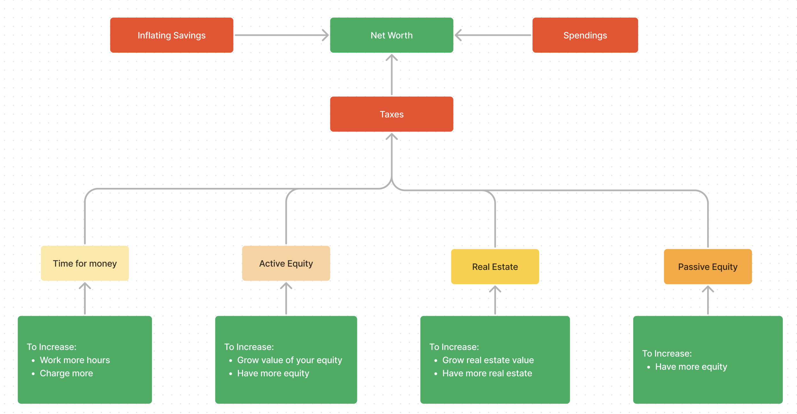

Let me share a simple model for increasing net worth that will provide you with more clarity on ways to make and grow your money.

Let's start with four fundamental methods of generating wealth. The first and most obvious way is to trade time for money by working at a job or being a solo freelancer. To make more, you can increase work capacity, but a day has only 24 hours, and you will hit the ceiling quickly. Alternatively, you can grow your value to a business and charge more. Large companies pay millions to C-suite operators because they manage a lot of people or capital, and one wrong decision can cost millions. You can make good money as an employee, but it can be a long path with not-so-pleasant work. You can also earn well enough without becoming a manager and working fewer hours through high-leverage work like programming.

Another way to generate wealth is through active equity. I call it "active" because your work impacts the asset's worth. For example, you may start a business, grow it, and as an owner, you can decide to do whatever you want with this asset. You can make it a passive cashflow entity or sell your equity to a larger company for lots of money. You might have the whole stake if you start a business yourself, or 50% if you do it with an equal cofounder, or dilute it with time by raising capital from investors. This path doesn't have a ceiling since you can infinitely grow the value of your equity. You can do this by making your business bigger and better. Usually, entrepreneurs get active equity by starting new ventures. However, it is also possible to get a small portion of this good stuff as an employee by joining a startup. This comes with the understanding that your impact won't be that important and you won't affect the venture much. But the "employee with equity" path comes with the understanding that your impact won't be that important and you may not affect the business much. Also, if it is an early-stage startup, you may work as much as a founder while having only tiny bites of equity. Often a better strategy could be to join a medium-sized company that still shares its potential upside or work at a less demanding job while building a business on the side. There are other ways to get equity in a good business, and in the future, it might be even easier to get access to stakes without starting something from scratch. It is worth being aware of active equity because it's one of the best ways to generate wealth unproportional to work hours.

The last two options are the most passive and require more capital to yield significant results. Real estate is one of the most reliable assets, as people always need somewhere to live. You can benefit from both price appreciation and rent money, but it still takes time to find deals and manage or maintain the property. The less time-consuming way of earning a return on capital is to invest in passive equity, such as stocks or index funds like the S&P 500. These are long-term investments, and by being consistent over time, you can reduce the risk of losing money due to market volatility.

To summarize, the first two paths are the best for generating wealth, while the last two are more suited for retention and compounding. Early in our careers, why better focus on improving specific knowledge and judgment by working on the first two baskets rather than trying to optimize the last two ones without having much capital to deploy.

I have something to do with every basket. But almost all my income comes from selling time for money with a front-end developer job. I also try to get into active equity by expanding the surface area of opportunity with my two YouTube channels and productivity app Increaser. I also make some money by renting my old apartment in Tbilisi. I have some money in stocks, but I've made the mistake of putting everything at once at the pick of the market, and I'm significantly down at the current recession time.

Well, we like earning money, and the government does it too, so at some stage, you will share a part of your income by paying taxes. Yet, there are opportunities to reduce the fee by picking countries that are friendly for specific income types. Some countries won't ask to share with them foreign income, while others will have small property taxes. And as a remote worker, instead of paying half of your salary in New York, you can go to eastern Europe and pay less than 20%.

To have more money to invest, you can cut your spending on unimportant things or move to a country with a lower cost of living. Savings are always beneficial. However, since we live in hight-inflation times, it is better to reinvest the surplus instead of losing 8% annually. Check [this video](https://youtu.be/_w5wrE_eN4o) to learn more about how to protect yourself against inflation.
